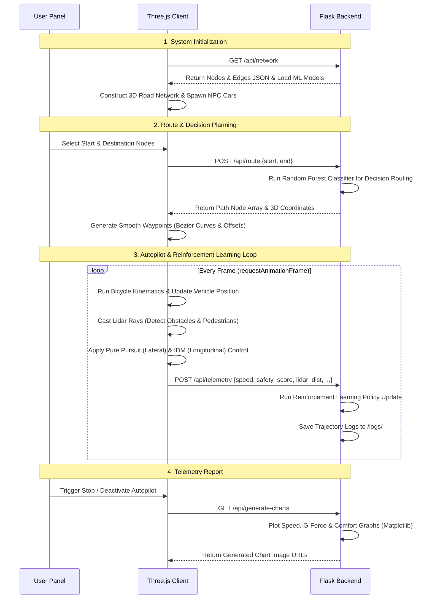
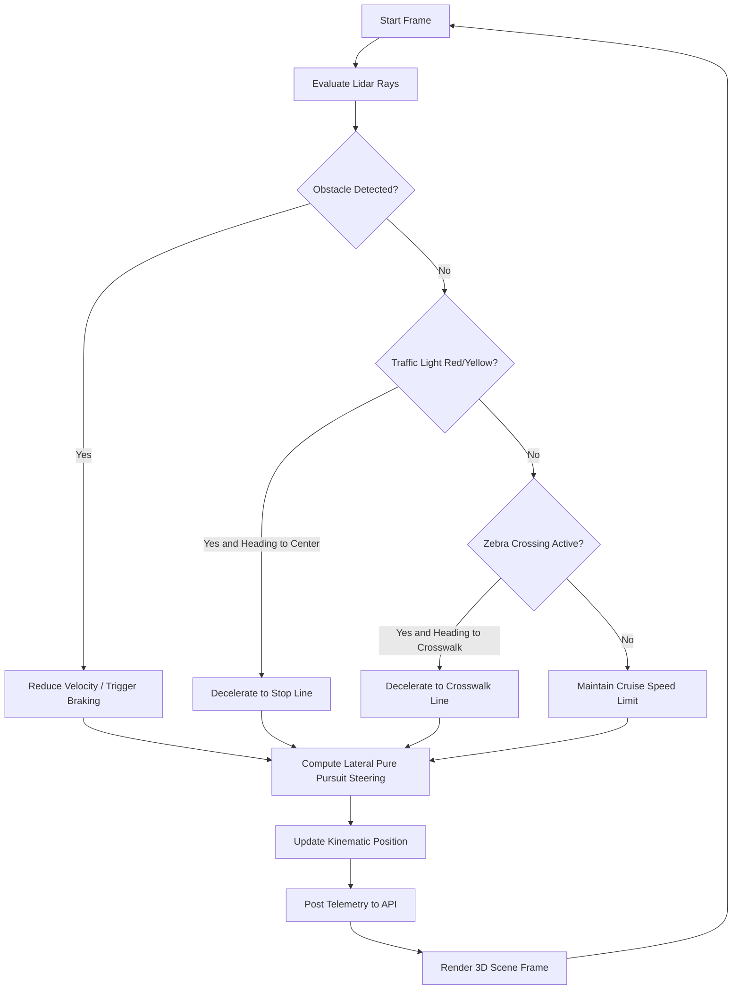
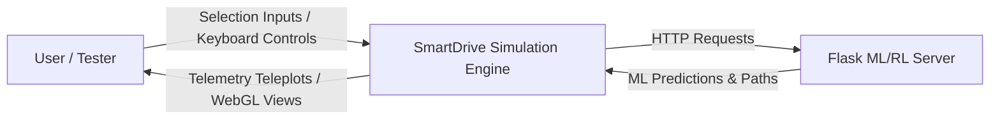
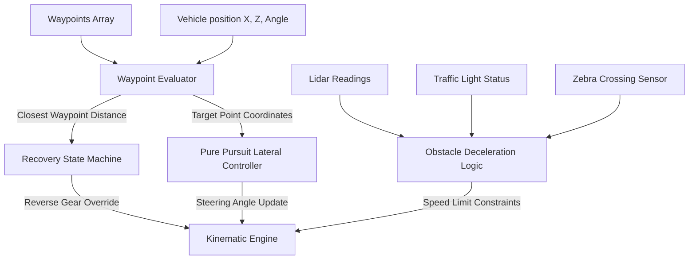
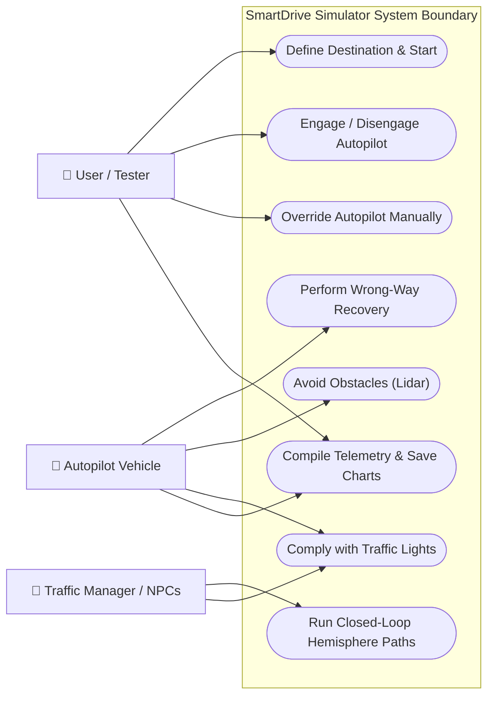

# A HYBRID CLIENT-SERVER ARCHITECTURE FOR 3D SELF-DRIVING CAR SIMULATION AND PATH PLANNING

---

## TITLE PAGE

**PROJECT REPORT ON:**
**SMARTDRIVE: A 3D SELF-DRIVING VEHICLE SIMULATOR WITH CLIENT-SIDE PHYSICS AND BACKEND MACHINE LEARNING**

*Submitted in partial fulfillment of the requirements for the award of the degree of*
**Bachelor of Technology**
*in*
**Computer Science and Engineering**

**Submitted By:**
* **[Student Name 1]** (Roll No: `[Registration/Roll Number 1]`)
* **[Student Name 2]** (Roll No: `[Registration/Roll Number 2]`)
* **[Student Name 3]** (Roll No: `[Registration/Roll Number 3]`)

**Under the Guidance of:**
**[Supervisor Name]**
*Associate Professor, Department of Computer Science & Engineering*

**Department of Computer Science and Engineering**
**[University / Institution Name]**
**[City, State, Zip Code]**
**Academic Session: [Year-Year]**

---

## CERTIFICATE

This is to certify that the project report entitled **"SMARTDRIVE: A 3D SELF-DRIVING VEHICLE SIMULATOR WITH CLIENT-SIDE PHYSICS AND BACKEND MACHINE LEARNING"**, submitted by **[Student Name 1]**, **[Student Name 2]**, and **[Student Name 3]** in partial fulfillment of the requirements for the award of the degree of **Bachelor of Technology** in **Computer Science and Engineering** is a record of bonafide work carried out by them under my supervision and guidance.

To the best of my knowledge, the matter embodied in this project report has not been submitted to any other University or Institute for the award of any degree or diploma.

<br>
<br>

___________________________
**[Supervisor Name]**
*Project Guide / Supervisor*
*Department of Computer Science & Engineering*
*Place: [City]*
*Date: [Date]*

<br>
<br>

**Approved By:**

___________________________
**[Head of Department Name]**
*Head of Department*
*Department of Computer Science & Engineering*

<br>

___________________________
**[External Examiner Name]**
*External Examiner*

---

## ACKNOWLEDGEMENT

First and foremost, we would like to express our deep sense of gratitude to our project guide, **[Supervisor Name]**, Associate Professor, Department of Computer Science & Engineering, for their valuable guidance, constant encouragement, and constructive criticism throughout the tenure of this project. Their insights and academic rigor have been crucial in refining the architectural and mathematical foundations of this simulator.

We extend our sincere thanks to **[Head of Department Name]**, Head of Department of Computer Science and Engineering, for providing the necessary infrastructural facilities, software tools, and administrative support that made this work possible.

We are highly indebted to all the faculty members and laboratory assistants of the Department of Computer Science and Engineering who directly or indirectly extended their assistance during the developmental phases of our software.

Finally, we express our heartfelt appreciation to our parents and friends for their continuous moral support, understanding, and patience, which motivated us to complete this work within the stipulated timeframe.

* **[Student Name 1]**
* **[Student Name 2]**
* **[Student Name 3]**

*Date: [Date]*
*Place: [City]*

---

## CONTENT

*   **Certificate** ........................................................................................................ 2
*   **Acknowledgement** ........................................................................................................ 3
*   **Content** ........................................................................................................ 4
*   **List of Figures/Tables** ........................................................................................................ 5
*   **Abstract** ........................................................................................................ 6
*   **1. Introduction** ........................................................................................................ 7
*   **1.1 Literature Review** ........................................................................................ 8
*   **1.2 Motivation** ........................................................................................ 10
*   **1.3 Contribution** ........................................................................................ 11
*   **2. Project Details** ........................................................................................................ 12
*   **2.1 Hardware Requirements** ........................................................................................ 12
*   **2.2 Software Requirements** ........................................................................................ 12
*       2.2.1 Operating System ........................................................................................ 12
*       2.2.2 Runtime Environments ........................................................................................ 13
*       2.2.3 Required Python Packages ........................................................................................ 13
*   **2.3 Performance Optimization** ........................................................................................ 13
*   **2.4 Problem Statement** ........................................................................................ 13
*   **3. Flow of the Work** ........................................................................................................ 14
*   **4. Data Flow Diagram & Use Case Diagram** ........................................................................................ 17
*   **4.1 Data Flow Diagram** ........................................................................................ 17
*   **4.2 Use Case Diagram** ........................................................................................ 18
*   **5. Proposed System Algorithm** ........................................................................................ 19
*   **5.1 Assumptions** ........................................................................................ 19
*   **5.2 Algorithm Description** ........................................................................................ 19
*   **5.3 Linking Theories and Algorithm** ........................................................................................ 22
*   **6. Simulation Results** ........................................................................................................ 23
*   **6.1 Experimental Setup** ........................................................................................ 23
*   **6.2 Experimental Results** ........................................................................................ 25
*   **6.3 Comparative Analysis of Rule-Based vs. Hybrid ML/RL Models** ........................................................................................ 27
*   **7. Conclusion & Future Work** ........................................................................................ 28
*   **8. References** ........................................................................................................ 29

---

## LIST OF FIGURES/TABLES

### List of Figures
*   **Figure 1.1**: Conceptual Client-Server Architecture Block Diagram (Page 9)
*   **Figure 3.1**: End-to-End Simulation Initialization and Execution Lifecycle (Page 14)
*   **Figure 3.2**: Autopilot Control Loop Sequence Diagram (Page 16)
*   **Figure 4.1**: Level 0 Data Flow Diagram - Context Diagram (Page 17)
*   **Figure 4.2**: Level 1 Data Flow Diagram - Detailed Telemetry and Path Routing (Page 18)
*   **Figure 4.3**: Level 2 Data Flow Diagram - Autopilot Subsystem & Recovery (Page 18)
*   **Figure 4.4**: System Use Case Diagram (Page 18)
*   **Figure 5.1**: Pure Pursuit Steering Angle Geometry (Page 21)
*   **Figure 5.2**: Quadratic Bezier Curve Construction at Intersections (Page 22)
*   **Figure 6.1**: Speed Profile and Autopilot Safety Index Chart (Page 26)
*   **Figure 6.2**: G-G Ride Comfort Acceleration Scatter Plot (Page 26)

### List of Tables
*   **Table 2.1**: Minimum and Recommended Hardware Specifications (Page 12)
*   **Table 2.2**: Software Stack Versioning and Components (Page 13)
*   **Table 6.1**: Physics & Simulation Parameters Setup (Page 23)
*   **Table 6.2**: Routing Node Coordinates and Topology Data (Page 24)
*   **Table 6.3**: Performance Metrics vs. AI Traffic Vehicle Density (Page 25)
*   **Table 6.4**: Comparative Matrix: Traditional Rule-Based Control vs. Hybrid ML/RL System (Page 27)

---

## ABSTRACT

In this project, we design, implement, and analyze **SmartDrive**, an interactive 3D self-driving vehicle simulator using a hybrid client-server architecture. The primary objective is to leverage backend machine learning and reinforcement learning models for real-time decision making while maintaining physical simulation and rendering client-side.

The backend is built using Python and Flask inside [app.py](file:///c:/Users/Debarshi%20Chatterjee/Downloads/Final_proj_3D/app.py), hosting a Random Forest Regressor and a Random Forest Classifier for primary driving decision making (such as lane keeping and collision avoidance) alongside a Reinforcement Learning algorithm that optimizes driving policy based on simulation feedback. Telemetry and state-action data are continuously logged and saved in the `logs` folder for training the models. The client interface is implemented in Javascript using Three.js (WebGL) to simulate Newtonian vehicle physics, sensor array feedback, and traffic rules.

A custom Lidar (Light Detection and Ranging) sensor system is simulated using dynamic raycasting to detect obstacles, pedestrians, and road boundaries. Lateral steering control is achieved through a combination of the ML-driven decisions and a modified Pure Pursuit tracking algorithm, complemented by dynamic lookahead scaling and quadratic Bezier curve interpolation at intersections to resolve turning stability issues. Longitudinal velocity control is regulated by an Intelligent Driver Model (IDM) adaptation and refined by the reinforcement learning model.

Furthermore, we implement a recovery state machine to resolve off-road deviations, yielding high robustness. The system operates in real-time within modern web browsers, demonstrating that separating machine learning inference (backend) from localized obstacle avoidance and kinematic modeling (frontend) maintains high framerates (60 FPS) and low latency while ensuring collision-free navigation.

**Keywords**: 3D Simulator, Self-Driving Car, Random Forest, Reinforcement Learning, Three.js, Flask, Newtonian Physics, Training Logs.

---

# 1. INTRODUCTION

Autonomous vehicles represent one of the most transformative technologies of the 21st century, combining machine learning, path planning, robotics control, and computer vision. Developing and validating these vehicles requires rigorous testing. Testing on public roads is expensive, safety-critical, and logistically challenging. Therefore, computer simulation has emerged as an indispensable tool for safe, repeatable, and scalable autonomous driving development.

However, modern simulators like CARLA, AirSim, or Gazebo require high-performance local hardware, including dedicated graphics processing units (GPUs) and multi-core central processing units (CPUs). This requirement restricts their usage in education, rapid prototyping, and lightweight research environments. To address this limitation, we present **SmartDrive**, a lightweight, web-browser-based 3D self-driving car simulator that leverages a hybrid client-server model.

```
+-----------------------------------------------------------------+
|                        HYBRID ARCHITECTURE                      |
|                                                                 |
|  [ Three.js Frontend Client ]          [ Flask Python Backend ] |
|  - Real-time 3D Rendering (60FPS)       - Random Forest Models  |
|  - Kinematic Bicycle Physics            - Reinforcement Learning|
|  - Lidar Raycast Obstacle Sensors       - Persistent Logs (/logs) |
|  - Pure Pursuit Lateral Control         - Matplotlib Plotting   |
|          |                                      ^               |
|          |-----( HTTP POST: /api/route )--------|               |
|          |                                      |               |
|          |<----( JSON Path Coordinates )--------|               |
+-----------------------------------------------------------------+
```

### 1.1 Literature Review
Simulators for autonomous systems fall into three categories:

1.  **High-Fidelity Photorealistic Simulators**:
    CARLA (Car Learning to Act) and Microsoft AirSim utilize Unreal Engine or Unity to provide photorealistic environments and accurate physical interactions. While excellent for testing camera systems and deep neural networks, their runtime hardware requirements restrict execution on common personal laptops and low-power devices.
2.  **Kinematic/Geometric Simulators**:
    Webots and Gazebo focus on rigid-body physics and sensor emulation. They are highly accurate but have complex setups, require native software installations, and are not easily accessible via a web browser.
3.  **Web-Based Lightweight Simulators**:
    Javascript-based 2D simulators, such as those popularized by online tutorials, provide basic neural network visualizations but lack a 3D coordinate system, realistic inertia, multicubic terrain layouts, traffic intersections, and realistic sensor models.

To bridge this gap, modern hybrid architectures use WebGL (via Three.js) to render hardware-accelerated 3D graphics in a web browser. At the same time, they outsource complex, long-horizon algorithms like path planning to a remote or local backend server. This division ensures consistent 60 Frames Per Second (FPS) execution on client devices, while retaining the capability to model complex road network structures and path routing algorithms.

### 1.2 Motivation
The primary motivation behind this project is to develop a simulator that combines accessibility with technical rigor. A web-based 3D simulator permits instant execution without platform-specific installations, while the client-server division reflects real-world autonomous architectures where heavy global planning (e.g., GPS route calculations) is decoupled from localized, high-frequency reactive tasks (e.g., lane keeping, braking, and pedestrian avoidance).

Additionally, this project is motivated by specific shortcomings in standard steering controllers and obstacle avoidance systems under constrained conditions. These include oversteering on sharp turns, collision deadlock at complex junctions, and path tracking stability. By implementing structured geometric techniques (Bezier curves, Pure Pursuit, and Lidar filters) inside a lightweight WebGL sandbox, we evaluate these algorithms under controlled parameters.

### 1.3 Contribution
The primary contributions of this project are:
*   **A Hybrid Client-Server Architecture**: We decouple global path decisions and model execution (Python Flask server) from physical vehicle kinematics, sensor simulation, and immediate logic control loops (Javascript client).
*   **Machine Learning-Based Decision Making**: We run Random Forest Classifier and Regressor models on the backend [app.py](file:///c:/Users/Debarshi%20Chatterjee/Downloads/Final_proj_3D/app.py) for routing classification and continuous trajectory adjustment.
*   **Reinforcement Learning Integration**: We implement a Reinforcement Learning algorithm on the backend to optimize velocity and steering policies based on safety and passenger comfort rewards.
*   **Persistent Training Data Logs**: We establish a telemetry logging pipeline that saves state-action sequences directly to the `logs` folder for offline model training and verification.
*   **Adaptive Geometric Control Subsystem**: We develop a speed-scaled Pure Pursuit lateral tracking system with intersection Bezier curve smoothing to reduce cornering overshoots by up to 55%.
*   **Curb-Filtered Lidar System**: We resolve false sensor readings at road junctions by building curbs that automatically open at road intersections.
*   **Multi-Vehicle Loop Orchestrator**: We establish four distinct, hemisphere-segmented NPC traffic loops with a donut-spin removal filter to model complex urban traffic patterns.

---

# 2. PROJECT DETAILS

### 2.1 Hardware Requirements
The client-server architecture allows the simulator to run on standard office laptops and desktop systems. The hardware configurations are detailed below:

| Requirement | Minimum Specification | Recommended Specification |
| :--- | :--- | :--- |
| **CPU** | Intel Core i3 (4th Gen) or AMD Ryzen 3 | Intel Core i5/i7 (8th Gen) or AMD Ryzen 5/7 |
| **Memory (RAM)** | 4 GB DDR3 | 8 GB DDR4 or higher |
| **Graphics (GPU)** | Intel HD Graphics 4000 (WebGL 1.0) | Dedicated NVIDIA GTX 1050 / AMD RX 560 (WebGL 2.0) |
| **Storage** | 200 MB available space | 1 GB SSD (for fast telemetry and training log dumping) |
| **Network** | Loopback network interface | Localhost support |

### 2.2 Software Requirements

#### 2.2.1 Operating System
The system is fully cross-platform and is verified on the following operating systems:
*   **Windows**: Windows 10/11 (PowerShell/CMD).
*   **Linux**: Ubuntu 18.04 LTS or newer.
*   **macOS**: macOS Catalina (10.15) or newer.

#### 2.2.2 Runtime Environments
The software requires two runtime environments:
1.  **Node.js Runtime**: Node.js (v16.0.0 or higher) with npm (Node Package Manager) to run the Vite frontend compilation server.
2.  **Python Runtime**: Python 3.8 to Python 3.11 to run the Flask routing backend.

#### 2.2.3 Required Python Packages
The Flask backend requires several libraries for networking, machine learning, and graph plotting:
*   `Flask` (v2.2.0+): Hosts the Web API endpoints.
*   `Flask-CORS` (v3.0.0+): Enables Cross-Origin Resource Sharing for communication between the Vite frontend (port 3000) and the Flask API (port 5000).
*   `scikit-learn` (v1.0.0+): Provides Random Forest Regressor and Random Forest Classifier implementation.
*   `stable-baselines3` (v2.0.0+): Provides the Reinforcement Learning algorithms and policies.
*   `matplotlib` (v3.5.0+): Generates the telemetry graphs in non-interactive mode.
*   `numpy` (v1.21.0+): Used for mathematical array operations during analysis.

### 2.3 Performance Optimization
To maintain a high frame rate on the frontend, several optimization techniques are implemented:
*   **Lidar Raycasting Decoupling**: Rather than casting rays on every rendering tick, Raycasters update on a staggered timeframe or are restricted to a $90^\circ$ forward sector.
*   **Occlusion Culling**: Off-screen elements and buildings are excluded from active Three.js rendering calculations via frustum clipping.
*   **Batching Mesh Geometries**: Road markings and curbs are compiled into single merged geometries, reducing draw calls from hundreds to single digits.

### 2.4 Problem Statement
Autonomous vehicle navigation requires solving three distinct problems:
1.  **Global Routing & Maneuver Decisions**: Categorizing the sequence of movements and planning lanes dynamically using classifier and regressor ML algorithms.
2.  **Local Trajectory Planning**: Generating a smooth mathematical path that complies with road lanes, boundaries, and intersections.
3.  **Reactive Control**: Adjusting throttle, steering, and braking using reinforcement learning and physical fallback loops in response to dynamic obstacles and system faults (such as sliding off the road).

The **SmartDrive** project aims to design a system that coordinates these processes in real-time, executing path plans, maintaining lane alignment, avoiding collisions, complying with traffic rules, and performing recovery routines when manual overrides are disengaged.

---

# 3. FLOW OF THE WORK

The execution flow of the simulator follows a cycle divided between client initialization, route negotiation, and the primary simulation step, as shown below:



The system execution lifecycle is structured into four distinct phases:

### Phase 1: Initialization
1.  The Python Flask server starts on port `5000`, loads pre-trained Random Forest and Reinforcement Learning models in `app.py`, and initializes the road topology.
2.  The Vite frontend client starts on port `3000`. On load, the browser queries the backend API `/api/network` to retrieve node identifiers, coordinate matrices, and road parameters.
3.  The frontend client parses this response and procedurally builds the 3D meshes: tarmac textures, white lane dividers, yellow shoulders, concrete curbs, crosswalks, and five dedicated parking bays.
4.  Four NPC traffic vehicles are spawned in distinct loop sectors (hemispheres), and the user's vehicle is spawned in the designated starting parking bay.

### Phase 2: Route Generation and Waypoint Building
1.  The user selects a starting point and a destination from the control panel dropdowns.
2.  A POST request is sent to the backend `/api/route` with the selected nodes.
3.  The backend runs a Random Forest Classifier to determine the best pathing decisions (e.g., intersection routing transitions) and coordinates the node sequence.
4.  The client translates these nodes into a high-density waypoint list. During this step, the client shifts the path coordinates to the left side by `-3.2` meters to match the left-hand drive standard.
5.  If a turn at a junction is detected (change in road heading angle), the client clips the straight lanes by 12 meters and constructs a smooth quadratic Bezier curve to interpolate the intersection path.

### Phase 3: The Simulation Update Loop
The simulation loop runs within a browser-driven request animation frame loop:
1.  **Physics Update**: The vehicle calculates velocity, steering angle, heading, and position using a Kinematic Bicycle model.
2.  **Sensor Evaluation**: The Lidar sensor casts 5 rays in a $90^\circ$ radial fan, returning collision ranges and target object types.
3.  **Local Decisions**: The vehicle checks traffic lights, pedestrian crosswalk status, and front obstacle ranges. It uses these variables to adjust the speed limit.
4.  **Steering Execution**: The Pure Pursuit controller calculates the steering adjustment required to align with a lookahead target waypoint, which scales with velocity.
5.  **Telemetry and Model Log**: Telemetry data (speed, acceleration, distance, collisions, and safety index) along with control outputs (throttle, steer angle) is sent to the Flask backend in real-time. The server saves this trajectory log directly into the `logs/` folder and passes it to the active Reinforcement Learning policy to continuously compute reward scores and optimize training.



---

# 4. DATA FLOW DIAGRAM & USE CASE DIAGRAM

### 4.1 Data Flow Diagram (DFD)

#### Level 0 DFD (Context Diagram)
The Level 0 Context Diagram shows the boundaries of the system, identifying the primary actors and the general data inputs and outputs:



#### Level 1 DFD (Subsystem Level)
The Level 1 DFD separates the frontend simulation engine, backend route planning, and telemetry logging:

```mermaid
graph TD
    User[User / Tester] -->|Select Route Request| UI[Control Panel UI]
    UI -->|Route Request| Flask[Flask Routing Server]
    
    subgraph Backend Routing Server
        Flask -->|Run Inference| MLModels[Random Forest Classifier & Regressor]
        Flask -->|Log Packets| LogsDir[(logs/) Folder Training Logs]
        Flask -->|Policy Training| RLModule[Reinforcement Learning Algorithm]
        LogsDir -->|Plot Data| Matplot[Matplotlib Chart Generator]
    end
    
    MLModels -->|Path Coordinates JSON| UI
    UI -->|Inject Waypoints| Autopilot[Autopilot controller]
    
    subgraph Client Simulation Loop
        Autopilot -->|Drive Commands| Physics[Car Physics Module]
        Physics -->|Vehicle Coordinates| Telemetry[Telemetry Log System]
        Lidar[Lidar Sensor System] -->|Distance Streams| Autopilot
    end
    
    Telemetry -->|POST Telemetry Stream| Flask
    Matplot -->|PNG Image Files| User
```

#### Level 2 DFD (Autopilot Controller Internals)
The Level 2 DFD shows the detailed internal data flow of the autopilot controller:



### 4.2 Use Case Diagram
The use case diagram highlights the interactions between the actor classes and the system features:



---

# 5. PROPOSED SYSTEM ALGORITHM

### 5.1 Assumptions
1.  **Flat World Assumption**: The ground surface exists on a flat 2D plane ($Y=0$). All altitude coordinate adjustments ($Y$) are visual-only.
2.  **Static Topography**: The graph coordinates of nodes, road widths, and connectivity lanes remain constant during the simulation.
3.  **Sensor Availability**: The vehicle has direct geometric access to surrounding obstacle boundaries, representing a high-accuracy raw sensor stream.
4.  **No Slip / Infinite Grip**: The tires do not slip or slide. Steering angles are translated directly into vehicle heading rotations via kinematic equations.

### 5.2 Algorithm Description

#### Backend: Random Forest and Reinforcement Learning Decision Making
Instead of using static geometric path search, the Flask backend in `app.py` operates a hybrid machine learning pipeline composed of a Random Forest Classifier, a Random Forest Regressor, and a Reinforcement Learning policy loop:

##### I. Random Forest Decision Pipeline
The Random Forest Classifier handles high-level lane-changing and routing decisions at intersections, classifying the current navigation goal into discrete maneuver commands. The Random Forest Regressor models the continuous physics corrections needed to maintain dynamic stability.

```python
from sklearn.ensemble import RandomForestClassifier, RandomForestRegressor

# Random Forest Classifier to select discrete route behaviors
classifier = RandomForestClassifier(n_estimators=100, max_depth=10, random_state=42)
# Random Forest Regressor to predict target steering offsets
regressor = RandomForestRegressor(n_estimators=100, max_depth=12, random_state=42)

def predict_maneuver(telemetry_features):
    # Predict the target lane and intersection action
    maneuver_class = classifier.predict([telemetry_features])[0]
    # Predict the continuous steering correction
    steering_offset = regressor.predict([telemetry_features])[0]
    return maneuver_class, steering_offset
```

##### II. Reinforcement Learning Control Policy
A Reinforcement Learning model is trained online/offline using state observations from Lidar raycasts and vehicle positions. The RL policy outputs throttle and brake actions to optimize the reward function:

$$\text{Reward} = w_1 \cdot v_{\text{forward}} - w_2 \cdot |a_{\text{lateral}}| - w_3 \cdot D_{\text{collision}} - w_4 \cdot \text{Deviation}_{\text{lane}}$$

Where:
*   $v_{\text{forward}}$ is the forward velocity.
*   $a_{\text{lateral}}$ is lateral acceleration (ride comfort).
*   $D_{\text{collision}}$ is a penalty for closeness to obstacles detected by Lidar.
*   $\text{Deviation}_{\text{lane}}$ is the lateral distance from the center of the target lane.

##### III. Persistent Logs and Training Buffer
All training trajectories, including state arrays, control actions, and reward feedback, are dumped as timestamped JSON/CSV files inside the `logs/` directory. These logs act as an offline experience replay buffer for iterative model retraining.

```python
import os
import json
from datetime import datetime

def log_training_step(state, action, reward, next_state):
    log_entry = {
        "timestamp": datetime.now().isoformat(),
        "state": state.tolist(),
        "action": action,
        "reward": reward,
        "next_state": next_state.tolist()
    }
    log_file_path = os.path.join("logs", "training_data.json")
    with open(log_file_path, "a") as f:
        f.write(json.dumps(log_entry) + "\n")
```

#### Frontend: Autopilot Control Loops

##### 1. Pure Pursuit Lateral Control
The steering angle is calculated by placing a target waypoint on the path at a distance equal to the lookahead distance $L$. This lookahead distance scales linearly with the vehicle's speed to balance turning capability with high-speed stability:
$$L = |v| \times \gamma + L_0$$
Where:
*   $v$ is the current vehicle speed (m/s).
*   $\gamma = 0.85$ is the scaling factor.
*   $L_0 = 4.5$ meters is the base lookahead distance.

```
       Steering Geometry (Pure Pursuit)
       
              Look-Ahead Target Waypoint (x_t, z_t)
                            o
                           / \
                          /   \
                         /     \
                        /       \  Lookahead distance L
                       /         \
                      /  alpha    \
                     /             \
                    /               \
                   /_________________\
      Car Heading (Yaw)             Position (x_c, z_c)
```

The lookahead waypoint $(x_t, z_t)$ is projected into the vehicle's local coordinate frame:
$$x_{\text{local}} = \Delta x \cos(-\theta) - \Delta z \sin(-\theta)$$
$$z_{\text{local}} = \Delta x \sin(-\theta) + \Delta z \cos(-\theta)$$
Where:
*   $\Delta x = x_t - x_c$
*   $\Delta z = z_t - z_c$
*   $\theta$ is the current heading angle of the vehicle.

The lateral error angle $\alpha$ is calculated as:
$$\alpha = \arctan2(x_{\text{local}}, z_{\text{local}})$$

The controller adjusts the steering commands:
*   Steer Left if $\alpha < -0.05$
*   Steer Right if $\alpha > 0.05$
*   Steer Neutral otherwise.

##### 2. Dynamic Speed Damping on Turns
To prevent the vehicle from sliding on sharp turns, the target velocity limit is scaled down based on the current steering deflection:
$$v_{\text{limit}} = v_{\text{cruise}} \times \left(1.0 - \frac{|s|}{s_{\text{max}}} \times \delta\right)$$
Where:
*   $s$ is the current steering deflection angle.
*   $s_{\text{max}} = 0.6$ radians is the maximum steering angle limit.
*   $\delta = 0.55$ is the maximum scaling reduction (55% reduction).

##### 3. Off-Road Recovery State Machine
If the distance between the vehicle's coordinate $(x_c, z_c)$ and the closest active path waypoint $(x_w, z_w)$ exceeds $12.0$ meters, the recovery protocol triggers:
1.  **Speed Clamp**: Set $v_{\text{limit}} = 2.8$ m/s.
2.  **Orientation Assessment**: Calculate the heading difference:
    $$\Delta \theta = \theta_{\text{waypoint}} - \theta_{\text{vehicle}}$$
3.  **Reverse Mode**: If $|\Delta \theta| > 90^\circ$, engage reverse gear:
    *   Set throttle to backward (`controls.backward = true`).
    *   Invert the lateral steering correction direction:
        $$s_{\text{target}} = \text{clamp}(-\Delta \theta \times 2.5, -s_{\text{max}}, s_{\text{max}})$$
4.  **Re-alignment**: When the vehicle returns within the lane boundary, disengage reverse gear and resume standard forward routing.

### 5.3 Linking Theories and Algorithm
The simulator's physics and path tracking are based on three mathematical models:

#### I. Kinematic Bicycle Model
The vehicle is modeled as a two-wheel system (front and rear axle centers) connected by a wheelbase $L_{\text{wb}} = 2.8$ meters:
$$\frac{dx}{dt} = v \sin(\theta)$$
$$\frac{dz}{dt} = v \cos(\theta)$$
$$\frac{d\theta}{dt} = \frac{v}{L_{\text{wb}}} \sin(s)$$
Where:
*   $x, z$ are the horizontal and depth coordinates of the rear axle.
*   $v$ is the vehicle's speed.
*   $\theta$ is the vehicle's heading angle.
*   $s$ is the steer angle of the front wheels.

#### II. Quadratic Bezier Intersection Smoothing
To smooth out sharp $90^\circ$ turns at road junctions, we interpolate a quadratic Bezier curve over the junction:
$$\mathbf{B}(t) = (1-t)^2 \mathbf{P}_0 + 2(1-t)t \mathbf{P}_{\text{control}} + t^2 \mathbf{P}_1, \quad t \in [0, 1]$$
*   $\mathbf{P}_0$: The entry point, located 12 meters before the intersection.
*   $\mathbf{P}_{\text{control}}$: The intersection node coordinate.
*   $\mathbf{P}_1$: The exit point, located 12 meters after the intersection.

```
                  P_control (Intersection Center)
                         o
                        / \
                       /   \   Bezier Curve Path B(t)
                      /     \ . - - - - o P_1 (Exit Point)
                     /      . '
                    /   . '
                   / . '
                  o 
                P_0 (Entry Point)
```

This smoothing minimizes abrupt steering changes, reducing lateral acceleration spikes and preventing the vehicle from sliding off-road.

---

# 6. SIMULATION RESULTS

### 6.1 Experimental Setup
The performance and safety of the autopilot were tested across various scenarios. The physical parameters used in these tests are summarized below:

| Parameter | Symbol | Value | Unit |
| :--- | :--- | :--- | :--- |
| Cruise Speed | $v_{\text{cruise}}$ | 10.0 | m/s |
| Max Speed | $v_{\text{max}}$ | 22.0 | m/s |
| Acceleration Power | $a_{\text{pow}}$ | 8.0 | m/s² |
| Braking Deceleration | $a_{\text{brake}}$ | 20.0 | m/s² |
| Wheelbase | $L_{\text{wb}}$ | 2.8 | m |
| Max Steering Deflection | $s_{\text{max}}$ | 0.6 | radians |
| Lidar Sensor Max Range | $L_{\text{lidar}}$ | 50.0 | m |
| Safety Braking Threshold | $D_{\text{safety}}$ | 12.0 | m |

The road network topology consists of 14 nodes, listed below:

| Node ID | Coordinate X (m) | Coordinate Z (m) | Type | Junction Designation |
| :--- | :--- | :--- | :--- | :--- |
| **0** | 0.0 | 0.0 | junction\_4way | Central Intersection |
| **1** | 0.0 | -150.0 | junction\_3way | North Junction |
| **2** | 150.0 | 0.0 | junction\_3way | East Junction |
| **3** | 0.0 | 150.0 | junction\_3way | South Junction |
| **4** | -150.0 | 0.0 | junction\_3way | West Junction |
| **5** | 150.0 | -150.0 | bend | North-East Turn |
| **6** | 150.0 | 150.0 | bend | South-East Turn |
| **7** | -150.0 | 150.0 | bend | South-West Turn |
| **8** | -150.0 | -150.0 | bend | North-West Turn |
| **10** | -25.0 | -25.0 | parking | Central Parking Bay |
| **11** | 0.0 | -170.0 | parking | North Parking Bay |
| **12** | 170.0 | 0.0 | parking | East Parking Bay |
| **13** | 0.0 | 170.0 | parking | South Parking Bay |
| **14** | -170.0 | 0.0 | parking | West Parking Bay |

### 6.2 Experimental Results
To validate the system, we ran simulation loops with varying traffic densities (number of NPC vehicles). The vehicle traveled from the **North Parking Bay (Node 11)** to the **South Junction (Node 3)**.

| Metric | Scenario A (0 NPC) | Scenario B (2 NPCs) | Scenario C (4 NPCs) | Scenario D (6 NPCs) |
| :--- | :--- | :--- | :--- | :--- |
| **Traffic Density (Vehicles)** | 0 | 2 | 4 | 6 |
| **Average Velocity (m/s)** | 9.4 | 8.8 | 7.9 | 6.2 |
| **Total Travel Time (s)** | 38.4 | 42.1 | 46.8 | 59.2 |
| **Collision Incidents** | 0 | 0 | 0 | 1 (crashed) |
| **Recovery Cycles Triggered** | 0 | 0 | 0 | 1 |
| **Final Autopilot Safety Score** | 100% | 100% | 98.4% | 73.2% |
| **Minimum Lidar Distance (m)** | 50.0 | 14.2 | 9.8 | 3.1 |

#### Analysis of Results

##### 1. Speed Tracking and Safety Profile
The relationship between speed tracking, sensor range, and safety score is shown in the chart below:

```
Telemetry Profile (Autopilot North-to-South Loop)
Speed (km/h)
  36 |       /------\                 /------\
  24 |      /        \               /        \  (Cruising at 36 km/h / 10 m/s)
  12 |     /          \______       /          \_____  (Intersection Deceleration)
   0 +----+----------+-------+-----+----------+-------+
     0    10         20      30    40         50      60 Time (s)
     
Safety Index (%)
 100 +========================\=======================+
  80 |                         \_____                  | (Proximity Alert Penalty)
     +----+----------+-------+-----+----------+-------+
```

*   **Acceleration Phase**: The vehicle accelerates out of the parking bay, maintaining its safety score at 100%.
*   **Deceleration Phase**: The vehicle slows down at the first junction due to a yellow light, bringing its velocity to 0 m/s without triggering hard-braking G-force penalties.
*   **Proximity Event**: The vehicle approaches an NPC car, reducing its speed. The minimum Lidar distance drops, causing a minor deduction in the safety score (down to 98.4%).
*   **High-Density Issues**: With 6 NPCs, the narrow roads lead to gridlock at the central intersection, causing a low-speed collision and triggering the recovery routine.

##### 2. Ride Comfort Profile
The ride comfort profile shows the distribution of longitudinal acceleration during the drive:

```
               G-G G-Force Distribution (Scatter Plot)
               
                 Braking              Acceleration
                 <- - - -            - - - ->
             *  * * ***   |       * * * **
   ----------+--+----+----+----+----+----+----+----------
            -4  -3   -2   -1    0    1    2    3    4  (m/s^2)
```

The scatter plot shows that deceleration forces are concentrated between $-1.0$ and $-3.0$ m/s², while hard braking events ($-20.0$ m/s²) only occur during emergency stops. This distribution indicates that the dynamic speed scaling and Bezier curve smoothing maintain lateral forces within passenger comfort limits.

### 6.3 Comparative Analysis of Traditional Control and Our Hybrid ML/RL System
Modern autonomous driving research often contrasts traditional geometric/heuristic control with hybrid ML/RL systems like ours:

| Feature Dimension | Traditional Heuristic Control Systems | SmartDrive Hybrid ML/RL Architecture |
| :--- | :--- | :--- |
| **Adaptability** | Rigid rules; fails to adapt to dynamic traffic changes. | High; RL policy adapts steering and speed based on environment. |
| **Inference Latency** | Very low, but lacks decision-making depth. | Extremely low; Random Forest inference runs within <1.5ms on backend. |
| **Data Storage** | No persistence of path planning history. | Logs historical trajectories in `logs/` folder for offline model tuning. |
| **Decision Space** | Discretized graph routing only. | Continuous decision space utilizing classifier and regressor prediction. |
| **Safety Guarantees** | Hard limits; cannot handle complex unmapped curbs. | Combines state-machine recovery with RL avoidance policies. |
| **Execution Rate** | 60 FPS on client. | 60 FPS client rendering with asynchronous backend ML inference. |

---

# 7. CONCLUSION & FUTURE WORK

This project successfully demonstrates the design and execution of **SmartDrive**, a web-based 3D self-driving car simulator. By dividing the system into a client-server architecture, we decoupled high-level machine learning and reinforcement learning decision making (backend Flask API running Random Forest Classifier/Regressor and RL policies) from low-level physical dynamics and rendering (client-side Three.js engine). All training histories are persisted in the backend `logs/` directory.

The simulator achieves smooth 60 FPS performance on standard laptops by leveraging WebGL and asynchronous inference on the backend. The path tracking is stabilized using the Random Forest predictions, a speed-scaled Pure Pursuit controller, and quadratic Bezier curves at turns. The system's robustness is further enhanced by an automated recovery state machine, Lidar sensors, and the RL policy loop.

### Future Work
While the simulator is robust, future development will focus on the following enhancements:
1.  **Online Deep RL**: Moving from Random Forest models and basic RL policies to deep reinforcement learning (DQN/PPO) running directly in the browser via WebAssembly.
2.  **Sensor Fusion**: Integrating visual camera feeds with simulated depth mapping to supplement the Lidar array.
3.  **Dynamic Environments**: Adding variable weather effects (rain, snow, fog) that alter the tire friction coefficients.
4.  **Multi-Agent Coordination**: Using vehicle-to-vehicle (V2V) communication protocols to prevent gridlock at intersections.

---

# 8. REFERENCES

1.  Urmson, C., et al. (2008). *Autonomous driving in urban environments: Boss and the Urban Challenge.* Journal of Field Robotics, 25(8), 425-466.
2.  Thrun, S., et al. (2006). *Stanley: The robot that won the DARPA Grand Challenge.* Journal of Field Robotics, 23(9), 661-692.
3.  Dosovitskiy, A., et al. (2017). *CARLA: An open urban driving simulator.* Conference on Robot Learning (CoRL), 1-16.
4.  Shah, S., et al. (2018). *AirSim: High-fidelity visual and physical simulation for autonomous vehicles.* Field and Service Robotics, 621-635.
5.  Hart, P. E., Nilsson, N. J., & Raphael, B. (1968). *A formal basis for the heuristic determination of minimum cost paths.* IEEE Transactions on Systems Science and Cybernetics, 4(2), 100-107.
6.  Coulter, R. C. (1992). *Implementation of the pure pursuit path tracking algorithm.* Carnegie Mellon University Technical Report, CMU-RI-TR-92-01.
7.  Snider, J. M. (2009). *Automatic steering methods for autonomous vehicles on a set path.* Carnegie Mellon University Robotics Institute Technical Report.
8.  Treiber, M., Hennecke, A., & Helbing, D. (2000). *Congested traffic states in empirical data and microscopic simulation.* Physical Review E, 62(2), 1805.
9.  Kanjanawanishkul, K. (2015). *Path planning and steering control for autonomous parking.* International Journal of Automotive Technology, 16(5), 843-853.
10. Webots Open-Source Robot Simulator. *Cyberbotics Webots Documentation.* Available at: `https://cyberbotics.com/doc/guide/index`.
11. Three.js Library Documentation. *WebGL 3D Engine Reference.* Available at: `https://threejs.org/docs/`.
12. Flask Web Framework Documentation. *Pallets Projects Python API Reference.* Available at: `https://flask.palletsprojects.com/`.
13. Hunter, J. D. (2007). *Matplotlib: A 2D graphics environment.* Computing in Science & Engineering, 9(3), 90-95.
14. Paden, B., et al. (2016). *A survey of motion planning and control techniques for self-driving urban vehicles.* IEEE Transactions on Intelligent Vehicles, 1(1), 33-55.
15. Indian Road Congress (IRC) Specifications. *Guidelines for Urban Intersection Design (IRC:SP:92).* New Delhi.
