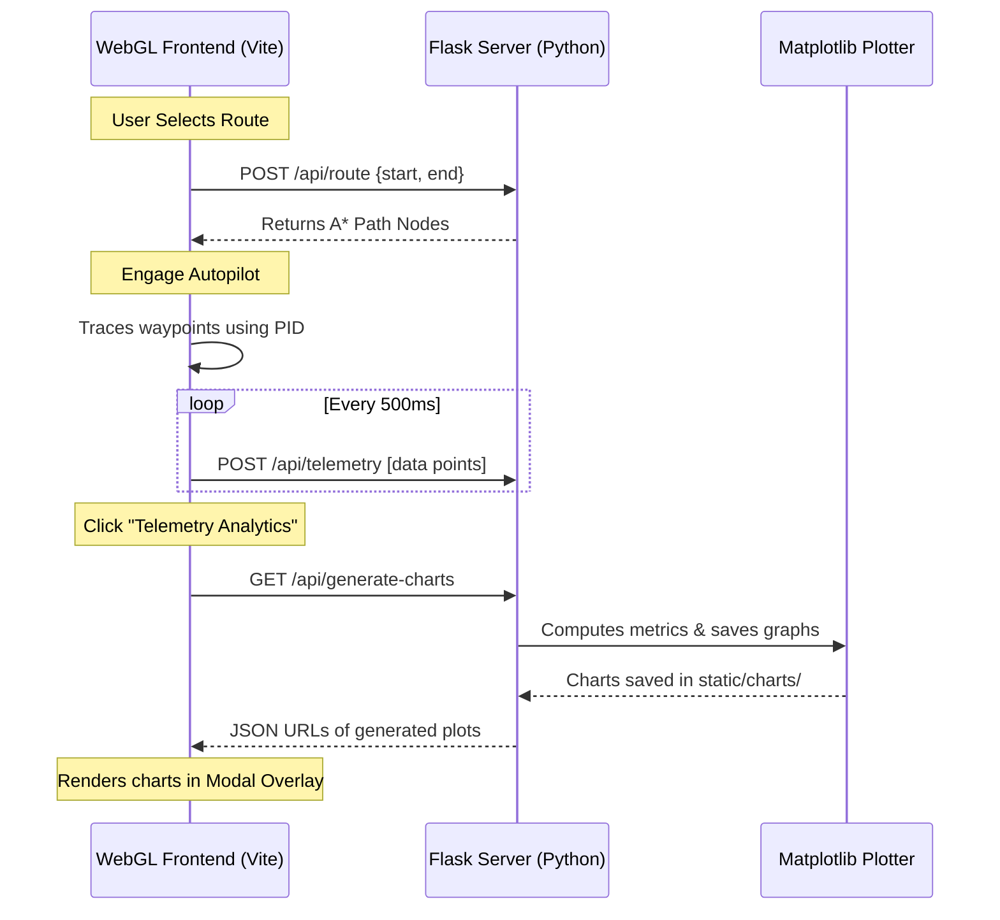

# System Architecture & Codebase Design

This document details the software architecture, module structure, backend APIs, and communication flows.

---

## 🏗️ Codebase Structure

```
├── models/                   # Pickled ML artifacts (offline Q-learning, classification, regression)
│   ├── decision_classifier.pkl
│   ├── q_table.pkl
│   └── speed_regressor.pkl
├── readme/                   # Detailed documentation folder
│   ├── overview.md
│   ├── setup.md
│   ├── architecture.md
│   └── controls.md
├── src/                      # Client-side source code
│   ├── simulator/            # Core 3D simulator classes
│   │   ├── Car.js            # Base physical car physics, mesh, and steering
│   │   ├── RoadNetwork.js    # Procedural generation of 3D roads, lights, and lanes
│   │   ├── SelfDrivingCar.js # Path-following PID control & sensor feedback override
│   │   ├── Sensor.js         # LiDAR raycaster using Three.js Raycaster
│   │   └── TrafficManager.js # Coordinates NPC vehicles and crossing pedestrians
│   ├── main.js               # Entry point; sets up scene loop and UI integrations
│   └── style.css             # Glassmorphism panel interface styling
├── static/                   # Static files
│   └── charts/               # Directory where matplotlib outputs are saved
├── app.py                    # Flask server; handles pathfinding, telemetry, and plots
├── index.html                # Web interface layout
├── package.json              # Vite & Three.js package configurations
├── requirements.txt          # Python virtual env dependencies
└── vite.config.js            # Vite bundler server configs
```

---

## 🛠️ Simulator Core Classes (Frontend)

1. **`Car.js`**: Handles standard physical state computations (acceleration, deceleration, friction, steering limits, and geometry update math). Renders the 3D chassis, wheels, and front headlights.
2. **`SelfDrivingCar.js`**: Extends `Car.js` to implement autonomic behavior. Monitors waypoints computed by the A* backend. Calculates heading error vectors and speed constraints based on upcoming curves or traffic.
3. **`Sensor.js`**: Mounts a raycasting LiDAR to the front of the car. It casts rays at varying angles to measure proximity distances to obstacles, signaling warnings or initiating brakes.
4. **`RoadNetwork.js`**: Builds the WebGL environment. Connects geometric vertices into lanes, crosswalk boundaries, junction lines, and interactive red/green traffic lights.
5. **`TrafficManager.js`**: Creates and runs NPC cars and walking pedestrians. Governs local speeds to prevent traffic pileups.

---

## 📡 Flask Backend API Endpoints (Python)

The backend exposes a JSON REST API on port `5000`:

### 1. Network Mapping
- **URL**: `GET /api/network`
- **Response**: The road network adjacency schema showing junction nodes (`x`, `z` positions, types) and connecting road segments.

### 2. A* Pathfinding Route Planner
- **URL**: `POST /api/route`
- **Request Body**: `{"start": NodeID, "end": NodeID}`
- **Response**: List of node coordinates calculating the shortest route via the A* search algorithm.

### 3. Telemetry Storage
- **URL**: `POST /api/telemetry`
- **Request Body**: A JSON array of telemetry coordinates containing:
  `{ timestamp, speed, acceleration, distance, collisions, safety_score, lidar_min_dist }`
- **Action**: Appends data to active logs for plot generation.

### 4. Chart Generator
- **URL**: `GET /api/generate-charts`
- **Response**: File paths to generated Matplotlib charts:
  - `telemetry_summary.png`: Visualizes Speed Profiles and Safety Indexes over time.
  - `telemetry_comfort.png`: Maps comfort ratings using a G-Force distribution scatter plot.

### 5. Telemetry Reset
- **URL**: `POST /api/reset-telemetry`
- **Action**: Resets telemetry datasets and deletes old image charts from storage.

---

## 🔄 Data Communication Flow


